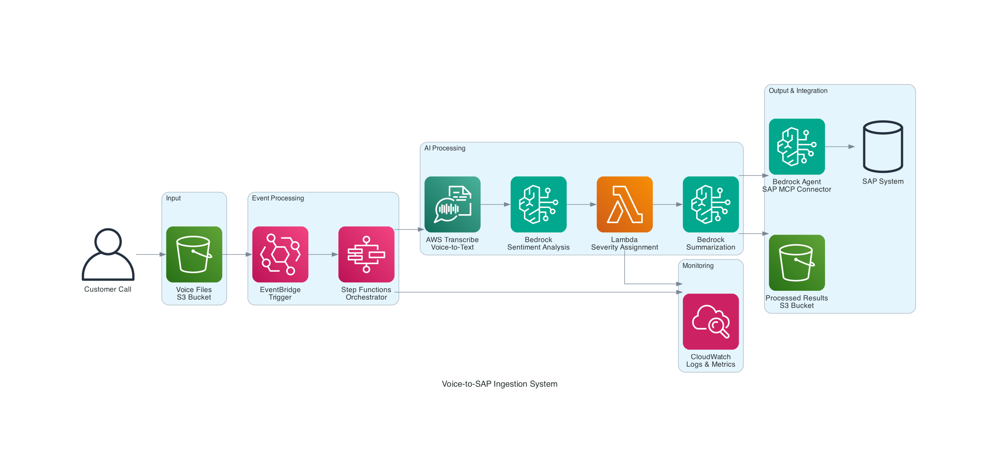

# Voice-to-SAP Ingestion System (TypeScript)

An automated system that processes voice call recordings using AWS Transcribe, performs sentiment analysis with Amazon Bedrock, and ingests structured data into SAP using Bedrock Agent Core with MCP connector.

## Architecture

The system processes voice files through the following pipeline:

1. **Voice File Upload** - Voice files uploaded to S3 trigger the processing pipeline via EventBridge
2. **AWS Transcribe** - Converts voice to text with high accuracy
3. **Bedrock Sentiment Analysis** - Claude 3 Sonnet analyzes sentiment and emotional intensity
4. **Severity Assignment** - TypeScript Lambda function assigns severity levels based on AI analysis
5. **Bedrock Summarization** - Generates concise summaries optimized for SAP ingestion
6. **SAP Integration** - Bedrock Agent with SAP MCP connector creates incidents/records in SAP

## Technology Stack

- **Language**: TypeScript
- **Infrastructure**: AWS CDK
- **AI Services**: Amazon Bedrock (Claude 3 Sonnet), AWS Transcribe
- **Orchestration**: AWS Step Functions
- **Storage**: Amazon S3
- **Events**: Amazon EventBridge
- **Compute**: AWS Lambda (Node.js 18.x)

## Project Structure

```
├── infrastructure/          # CDK TypeScript infrastructure
│   ├── lib/
│   │   └── voice-to-sap-stack.ts    # Main CDK stack
│   ├── bin/
│   │   └── infrastructure.ts        # CDK app entry point
│   └── package.json
├── test-system.ts          # TypeScript test suite
├── bedrock-agent-config.ts # Bedrock Agent configuration
├── deploy.sh              # Deployment script
└── README.md
```

## Setup & Deployment

### Prerequisites

1. **AWS CLI configured** with appropriate permissions
2. **Node.js 18+** and npm installed
3. **AWS CDK CLI** installed: `npm install -g aws-cdk`
4. **Bedrock models enabled** in your AWS account (Claude 3 Sonnet)

### Deploy

```bash
# Clone and navigate to project
cd voice-to-sap-ingestion

# Run deployment script
./deploy.sh
```

### Manual Deployment

```bash
cd infrastructure
npm install
npm run build
npx cdk bootstrap
npx cdk deploy
```

## Testing

### Test Step Functions Directly
```bash
cd infrastructure
npm run test:stepfunctions
```

### Test via S3 Upload (EventBridge trigger)
```bash
cd infrastructure
npm run test:upload
```

### Local Development
```bash
cd infrastructure
npm run watch    # Watch for TypeScript changes
npm run build    # Build TypeScript
npx cdk diff     # Preview changes
npx cdk synth    # Generate CloudFormation
```

## Components

### 🎯 **Core Services**
- **S3 Buckets**: Input (voice files) and output (processed results)
- **AWS Transcribe**: High-accuracy voice-to-text conversion
- **Amazon Bedrock**: Claude 3 Sonnet for sentiment analysis and summarization
- **Step Functions**: Orchestrates the complete pipeline with error handling
- **Lambda Function**: TypeScript-based severity assignment logic
- **EventBridge**: Event-driven architecture for automatic processing

### 🤖 **AI Integration**
- **Sentiment Analysis**: Bedrock analyzes emotional tone and intensity (1-10 scale)
- **Severity Classification**: AI-driven severity assignment (HIGH/MEDIUM/LOW)
- **Intelligent Summarization**: Context-aware summaries for SAP ingestion
- **Bedrock Agent**: Ready for SAP MCP connector integration

### 📊 **Data Flow**
1. Voice file → S3 input bucket
2. EventBridge → Step Functions execution
3. Transcribe → Text extraction
4. Bedrock → Sentiment analysis
5. Lambda → Severity assignment
6. Bedrock → Summary generation
7. S3 → Processed results storage
8. Bedrock Agent → SAP ingestion (via MCP)

## SAP Integration

The system includes a pre-configured Bedrock Agent for SAP integration:

### Agent Capabilities
- **Incident Creation**: Automatically creates SAP incidents from call data
- **Customer Updates**: Updates customer records with interaction history
- **History Retrieval**: Accesses previous customer interactions for context
- **Error Handling**: Graceful handling of SAP system errors

### MCP Connector Integration
The Bedrock Agent is configured to work with SAP MCP connectors providing:
- Standardized API endpoints for SAP operations
- Authentication and authorization handling
- Data validation and transformation
- Real-time status updates

## Monitoring & Observability

- **CloudWatch Logs**: Detailed execution logs for all components
- **Step Functions Console**: Visual workflow monitoring
- **X-Ray Tracing**: End-to-end request tracing (can be enabled)
- **CloudWatch Metrics**: Performance and error metrics

## Configuration

### Environment Variables
Set in CDK stack deployment:
- `CDK_DEFAULT_ACCOUNT`: AWS account ID
- `CDK_DEFAULT_REGION`: AWS region (default: us-east-1)

### Bedrock Models
Required models (request access in Bedrock console):
- `anthropic.claude-3-sonnet-20240229-v1:0`

## Security

- **IAM Roles**: Least privilege access for all services
- **S3 Bucket Policies**: Secure access controls
- **VPC Integration**: Can be configured for private networking
- **Encryption**: S3 server-side encryption enabled

## Cost Optimization

- **On-Demand Processing**: Pay only for actual voice file processing
- **Efficient Transcription**: Optimized for common audio formats
- **Smart Batching**: Bedrock calls optimized for cost efficiency
- **S3 Lifecycle**: Automatic cleanup of temporary files

## Troubleshooting

### Common Issues
1. **Bedrock Access Denied**: Enable Claude 3 Sonnet in Bedrock console
2. **CDK Bootstrap**: Run `npx cdk bootstrap` if deployment fails
3. **Permissions**: Ensure AWS CLI has sufficient permissions
4. **Node.js Version**: Requires Node.js 18+ for Lambda runtime compatibility

### Debug Commands
```bash
# Check CDK diff
npx cdk diff

# View synthesized template
npx cdk synth

# Check Step Functions execution
aws stepfunctions describe-execution --execution-arn <arn>

# View Lambda logs
aws logs tail /aws/lambda/VoiceToSapStack-SeverityAssignmentFunction
```

## Architecture Diagram



## Contributing

1. Make changes in TypeScript files
2. Run `npm run build` to compile
3. Test with `npm run test:stepfunctions`
4. Deploy with `npx cdk deploy`

## License

This project is licensed under the MIT License.
