# Voice-to-SAP MCP Integration Architecture

## Architecture Diagram


## Detailed Flow Diagram


## Component Layers


## Data Flow Example


## Authentication Flow

```mermaid
sequenceDiagram
    participant L as Lambda (SAP Integration)
    participant C as Cognito Token Endpoint
    participant A as AgentCore Runtime
    participant M as MCP Server
    participant S as SAP System
    
    Note over L,S: Inbound Authentication (Lambda → MCP)
    L->>C: POST /oauth2/token<br/>(client_credentials)
    C-->>L: Access Token (JWT)
    L->>A: POST /invocations<br/>Authorization: Bearer {token}
    A->>A: Validate Token
    
    Note over L,S: Outbound Authentication (MCP → SAP)
    A->>M: Invoke MCP Tool
    M->>S: OData API Call<br/>Authorization: Basic {credentials}
    S-->>M: Response
    M-->>A: Result
    A-->>L: Success
```



## Deployment Architecture


---

## How to View These Diagrams

### Option 1: GitHub/GitLab
If you push this to GitHub or GitLab, the Mermaid diagrams will render automatically.

### Option 2: VS Code
Install the "Markdown Preview Mermaid Support" extension and preview this file.

### Option 3: Online Viewer
Copy the Mermaid code and paste it into: https://mermaid.live/

### Option 4: Export as Image
Use the Mermaid CLI:
```bash
npm install -g @mermaid-js/mermaid-cli
mmdc -i ARCHITECTURE_DIAGRAM.md -o architecture.png
```

---

## Legend

- 🟧 Orange boxes = New MCP components
- 🔵 Blue boxes = SAP System
- ⚫ Black boxes = Existing AWS components

---

**Created**: December 6, 2025  
**Status**: Ready for Deployment
